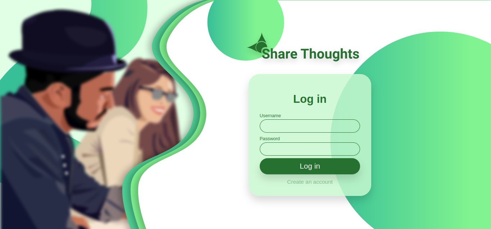
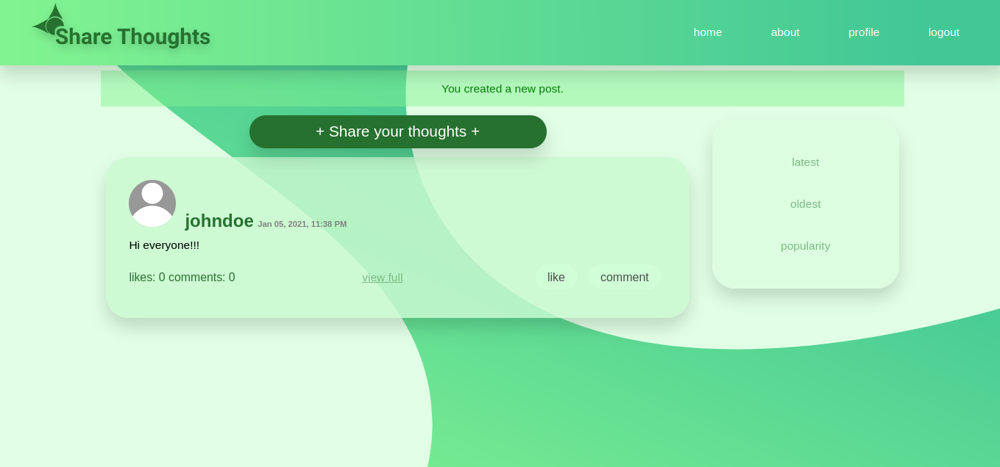

# Share Thoughts

I have created this simple web application with Django that shares people thoughts as
post and other people can comment or like on this. Its similar to Facebook post
system or twitter tweets but simpler version. I have used pure JavaScript to
build the user interface and SASS to style the site. And top of all its
responsive.

## This app comprised of 3 smaller sub-app:

### Main:

This is the main portion of the whole app. This sub-app includes a home page
that list all the post in the database in particular order and also include
separate page for each post. It also holds about page and landing page which
doesn’t have much logic just displaying plain page. All the models for the app
like Post model, Comment model, Profile model and more is also located here in
this sub-app.

Other than showing pages(home, post, about and landing page) this sub-app has
other functionality which can be categorize into two:

Basic Utilities  
This has three functionality:

- A logic for ‘liking a post’(that is, database is updated if user clicks the
  like button)

- A logic for ‘liking a comment’(similar to liking post instead here it is for
  comments)

- A filter logic (filters the posts in homepage depending upon what user
  clicked in the sidebar)

JSON page  
In this category there are three function that is used to send JSON API for the
JavaScript to handle:

- Post Json: This json is used in homepage by JavaScript to dynamically show
  the post and also to implement infinite scrolling

- Like-for-post Json: This data is used by JavaScript to update the style of
  the like button and update the status of ‘likes’

- Like-for-comment Json: similar to like-for-post json it is used for the
  comments rather than the post

### Login-Register:

This sub-app deals with all user registrations and logins. This sub-app have
three functionality:

- Login: Shows login form for user to login

- Register: Shows register form for user to register

- Logout: function that logouts and redirects to login page

### Profile:

This part of the app is part where user can change there user profile picture,
have nickname showed instead of username, change password and delete any post
they don’t want.

This sub-app only renders one page which contains two forms- Profile Settings
Form and Change Password Form, and list of all posts that the current logged-in
user have with a delete button on each

## JavaScript

JavaScript was mostly used in homepage to render all the post dynamically. But
for the post pages I used regular Django logic to render the data. I did this
because I can implement infinite scroll with JavaScript in the homepage. I also
added logic to like button in such a way that it triggers the function in Django
that used for liking post/comment(A logic for ‘liking a post’/ ‘liking a
comment’) and then fetches data from json API to update the state of button and
status of like.

Also collapsing animation of some forms were also implemented with JavaScript.

## Models(If you wanted to know how I structured my database table)

### Profile Model:

- User’s Nickname field

- Boolean value that tells whether to show nickname instead of username

- Profile Picture

### Post Model:

- User(Foreign Key)

- Text field

- Date when the post was posted

### Comment Model:

- User(Foreign Key)

- Post(Foreign Key)

- Text field

- Date when the comment was commented

### Like for Post Model:

- User(Foreign Key)

- Post(Foreign key)

- Boolean value that tells whether the given user liked or not

### Like for Comment Model:

- User(Foreign Key)

- Comment(Foreign Key)

- Boolean value that tells whether the given user liked or not

This app is designed and developed by single individual. Making this app was
hell of a pain but honestly it was more satisfying. I enjoyed and learned so
much. If you wanted visited this app live you can visit it here
http://ianyosuf.pythonanywhere.com/

Or the source code: https://github.com/KyrinZero/share-thoughts-app.git
