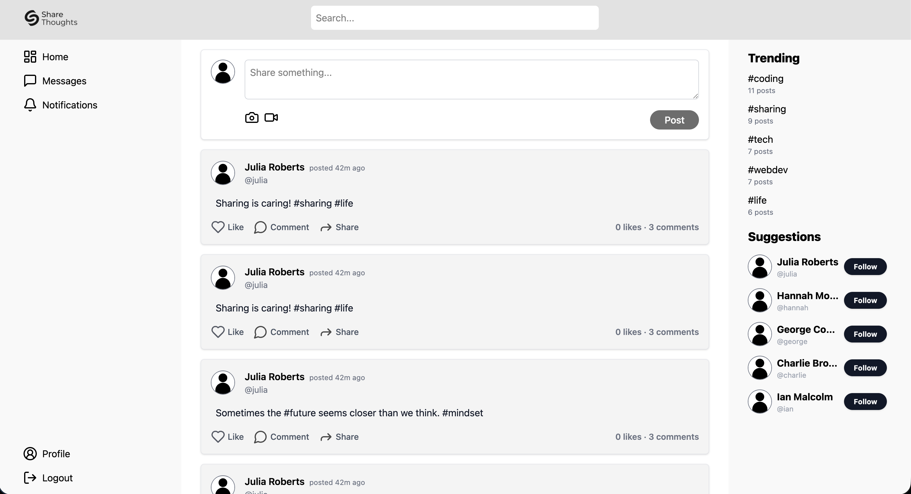

# Share Thoughts

 (Login/Register Page)
 (Home Page)

## What is Share Thoughts?
**Share Thoughts** is a social microblogging platform designed for simplicity and human connection. It's a space where users can post their immediate reflections, interact with others through likes and comments, and build a network of followers. 

### The Purpose
This project was originally born as a final project for Harvard's **CS50** (Introduction to Computer Science). It was my first major dive into the world of full-stack web development. I've now revisited this project to apply my more mature experience in software architecture, modern UI/UX design (using Tailwind CSS and Alpine.js), and containerization.

You can still view the original version of this project on the [legacy](https://github.com/KyrinZero/share-thoughts-app/tree/legacy) branch.

## Features
- **Public Profiles**: Explore user profiles to see their recent thoughts and followers.
- **Real-time Messaging**: A clean, single-page chat interface for private conversations.
- **Social Interactions**: Follow other users, like their thoughts, and engage in threaded comments.
- **Dynamic Feed**: An interactive home feed with infinite scroll and hashtag filtering.

---

## Getting Started

### Prerequisites
- Python 3.13+ (for non-docker setup)
- Docker & Docker Compose (for docker setup)

### Environment Variables
The app reads its configuration from a `.env` file (loaded automatically, and never committed — it's gitignored).

1. **Copy the example file:**
   ```bash
   cp .env.example .env
   ```

2. **Generate a secret key and paste it into `.env` as `SECRET_KEY`:**
   ```bash
   python -c "from django.core.management.utils import get_random_secret_key; print(get_random_secret_key())"
   ```

3. **Adjust the rest of `.env` as needed:**

   | Variable | Default | Description |
   |---|---|---|
   | `SECRET_KEY` | *(insecure dev key)* | Django's cryptographic signing key. Always set a real one outside of local dev. |
   | `DEBUG` | `True` | Must be `False` in any environment reachable by others. |
   | `ALLOWED_HOSTS` | `localhost,127.0.0.1` | Comma-separated hostnames allowed to serve the app; required when `DEBUG=False`. |
   | `SECURE_SSL_REDIRECT` | `False` | Redirect all HTTP traffic to HTTPS. Enable only once the app is served over TLS. |
   | `SESSION_COOKIE_SECURE` | `False` | Send session cookies only over HTTPS. Enable alongside `SECURE_SSL_REDIRECT`. |
   | `CSRF_COOKIE_SECURE` | `False` | Send the CSRF cookie only over HTTPS. Enable alongside `SECURE_SSL_REDIRECT`. |
   | `SECURE_HSTS_SECONDS` | `0` | HTTP Strict Transport Security duration, in seconds (e.g. `31536000` for one year). Only enable once HTTPS is confirmed working. |

   The defaults above are dev-friendly (plain HTTP) and work out of the box for both setups below.

### Option 1: Using Docker (Recommended)
This is the easiest way to get the project running with all its dependencies isolated.

1. **Clone the repository:**
   ```bash
   git clone https://github.com/KyrinZero/share-thoughts-app.git
   cd share-thoughts-app
   ```

2. **Set up your `.env` file** (see [Environment Variables](#environment-variables) above).

3. **Build and start the container:**
   ```bash
   docker compose up --build
   ```

4. **Run migrations** (first run only):
   ```bash
   docker compose exec app python manage.py migrate
   ```

5. **Access the app:**
   Open your browser and go to `http://localhost:8000`.

### Option 2: Local Development (Non-Docker)
If you prefer to run it directly on your machine:

1. **Clone the repository:**
   ```bash
   git clone https://github.com/KyrinZero/share-thoughts-app.git
   cd share-thoughts-app
   ```

2. **Create a virtual environment:**
   ```bash
   python -m venv venv
   source venv/bin/activate  # On Windows: venv\Scripts\activate
   ```

3. **Install dependencies:**
   ```bash
   pip install -r requirements.txt
   ```

4. **Set up your `.env` file** (see [Environment Variables](#environment-variables) above).

5. **Run migrations:**
   ```bash
   python manage.py migrate
   ```

6. **Start the development server:**
   ```bash
   python manage.py runserver
   ```

7. **Access the app:**
   Open your browser and go to `http://localhost:8000`.

---

## Acknowledgments
A massive thank you to **CS50** for providing the foundation and the spark that started my journey into programming. This project stands as a tribute to how much I've grown since that first "Hello, World."

---
